# Fuzzing Evaluation Report

**Configuration A (Baseline):** `encrypted_bytes`
**Configuration B (Experimental):** `ir-full-stack`

## 1. Summary Statistics

| Target   |   Duration (h) |   n (Baseline) |   n (Exp.) |   Median Cov. (Baseline) |   Median Cov. (Exp.) |   Adj. p-value (Cov.) |   Â12 (Cov.) |   Median AUC (Baseline) |   Median AUC (Exp.) |   Adj. p-value (AUC) |   Â12 (AUC) |   Union Cov. (Baseline) |   Union Cov. (Exp.) |   Execs/s (Baseline) |   Execs/s (Exp.) |
|:---------|---------------:|---------------:|-----------:|-------------------------:|---------------------:|----------------------:|-------------:|------------------------:|--------------------:|---------------------:|------------:|------------------------:|--------------------:|---------------------:|-----------------:|
| cln      |        23.9833 |             20 |         20 |                   7058.5 |               8367   |           2.65752e-07 |       1      |                  169269 |              196118 |          2.71059e-07 |      1      |                    7176 |               15841 |              163.145 |            6.035 |
| eclair   |        23.9833 |             20 |         20 |                   7851.5 |              11342.5 |           2.65752e-07 |       1      |                  183920 |              269235 |          2.71059e-07 |      1      |                    8584 |               11856 |               28.37  |            3.805 |
| ldk      |        23.9833 |             20 |         20 |                  13318   |              15690   |           2.65752e-07 |       1      |                  318152 |              370165 |          2.71059e-07 |      1      |                   16327 |               16460 |              398.715 |            9.28  |
| lnd      |        23.9833 |             20 |         20 |                  26118.5 |              26236.5 |           2.65752e-07 |       0.9925 |                  625430 |              627688 |          5.16578e-06 |      0.9225 |                   26305 |               26399 |              400.47  |           11.025 |

*A comprehensive version of this table is available in `coverage_evaluation_metrics.csv`.*

## 2. Interpretation Guide

- **`Adj. p-value`**: Mann-Whitney U test corrected for multiple targets via Holm-Bonferroni.
- **`Â12`**: Probability that a random B trial outperforms a random A trial (0.5 = no diff).
- **`IQR`**: Spread of the middle 50% of trials.
- **`AUC`**: Coverage *speed* — how much was discovered and how early.
- **Union Coverage**: OR of all trial bitmaps; the coverage ceiling for a multi-core deployment.

## 3. Visualizations

### Target: cln

#### Median Coverage Over Time

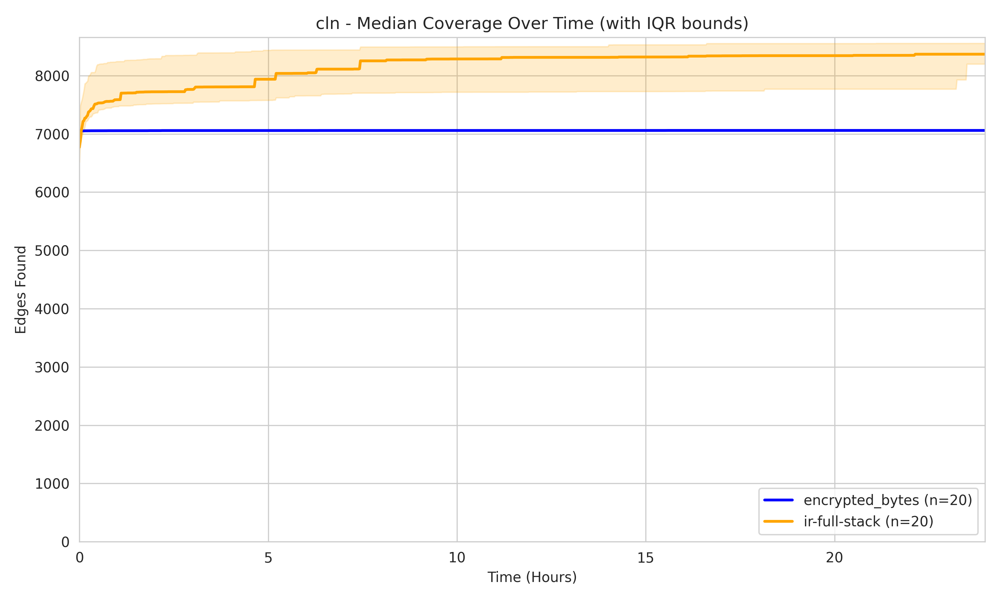

#### Distribution Comparisons

| Final Edge Coverage | Area Under Curve (Speed) |
|:---:|:---:|
| 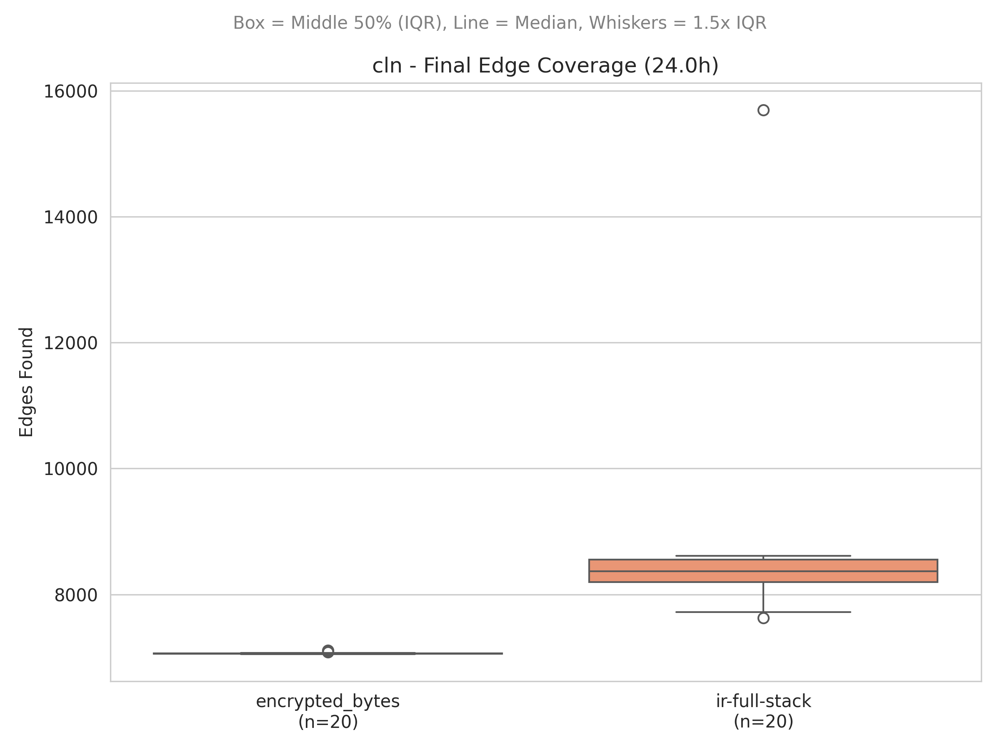 | 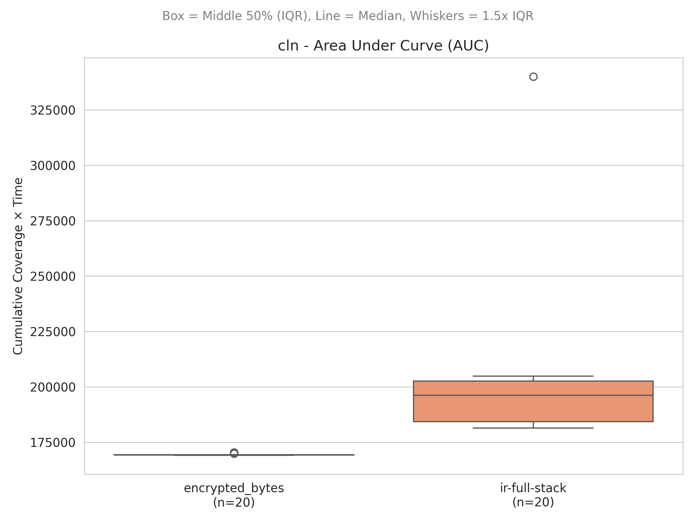 |

---

### Target: eclair

#### Median Coverage Over Time

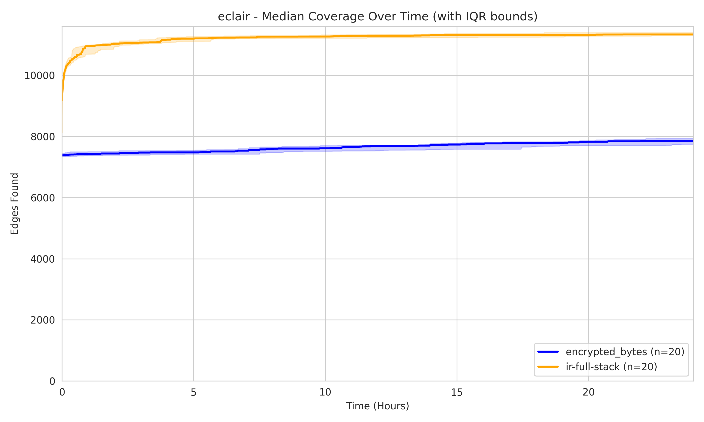

#### Distribution Comparisons

| Final Edge Coverage | Area Under Curve (Speed) |
|:---:|:---:|
| 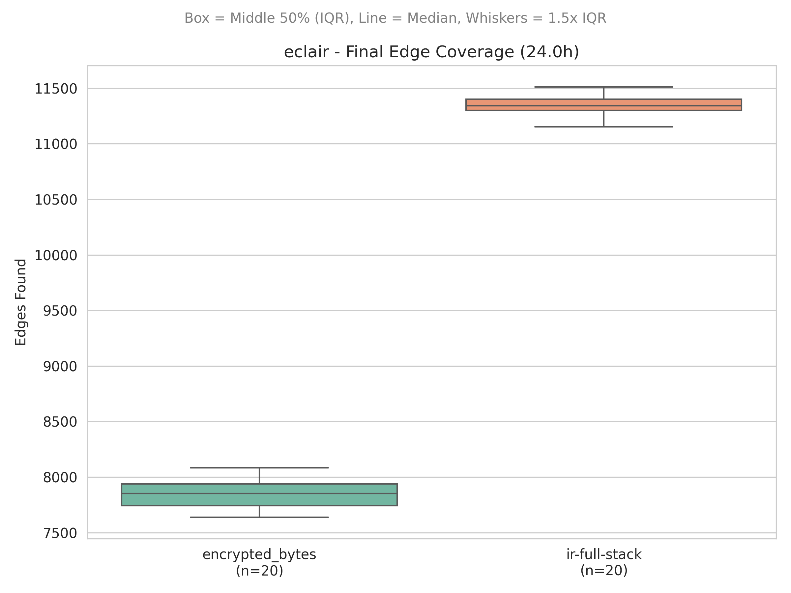 | 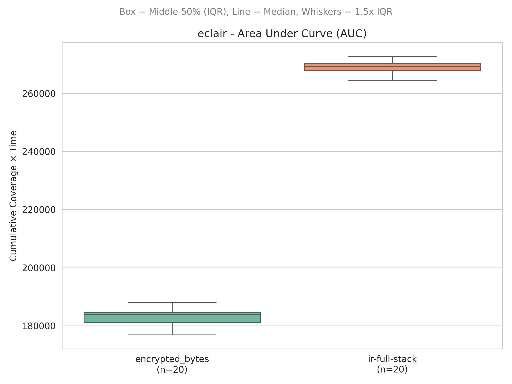 |

---

### Target: ldk

#### Median Coverage Over Time

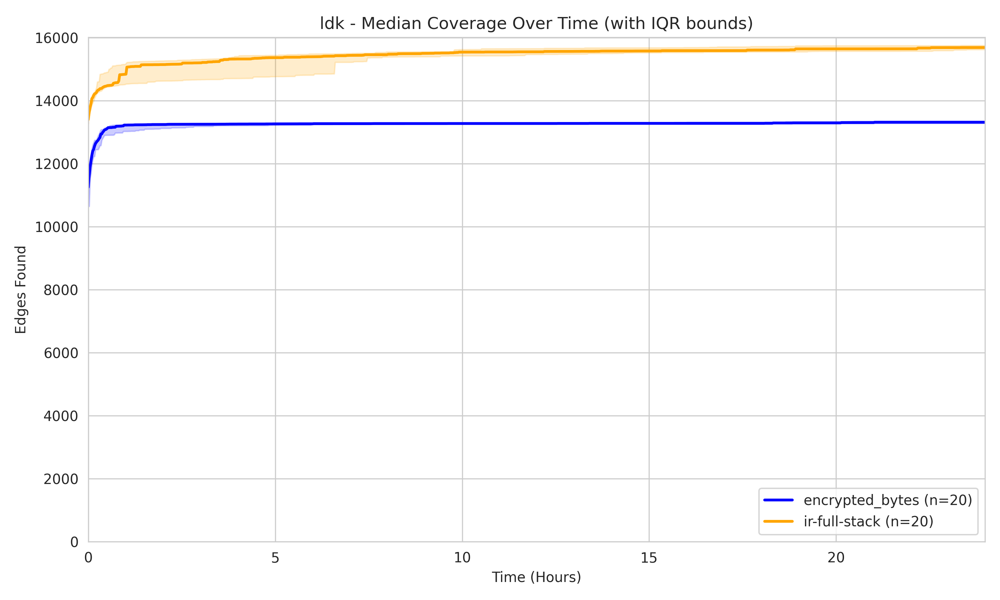

#### Distribution Comparisons

| Final Edge Coverage | Area Under Curve (Speed) |
|:---:|:---:|
| 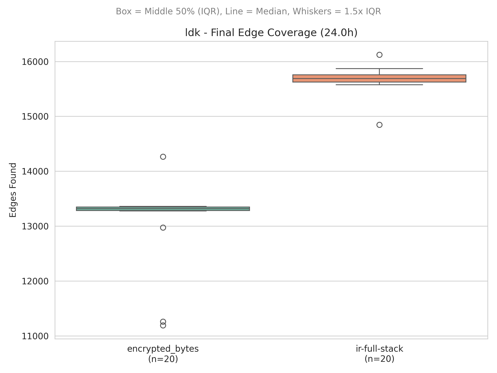 | 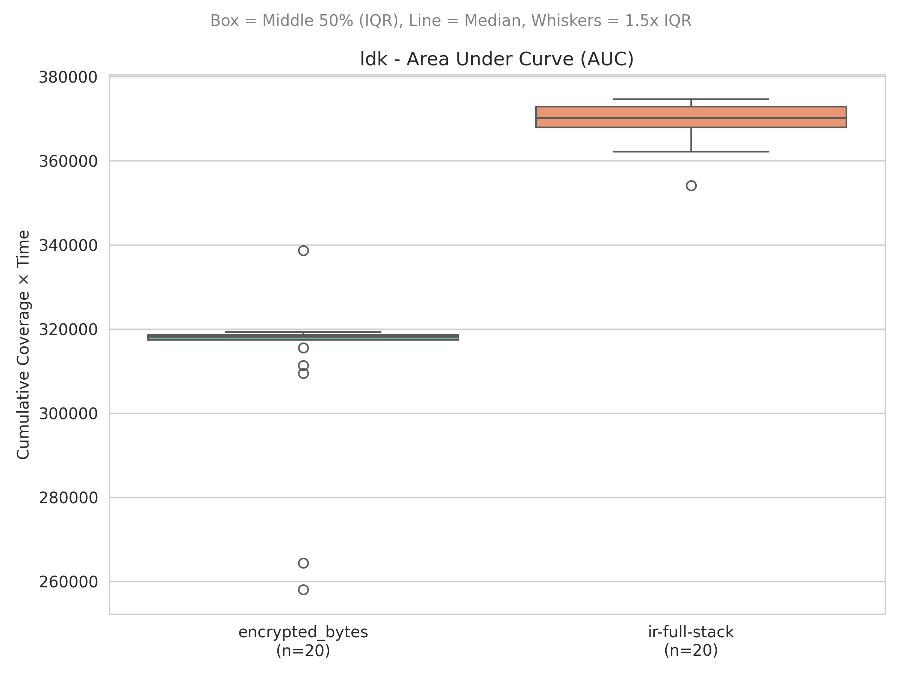 |

---

### Target: lnd

#### Median Coverage Over Time

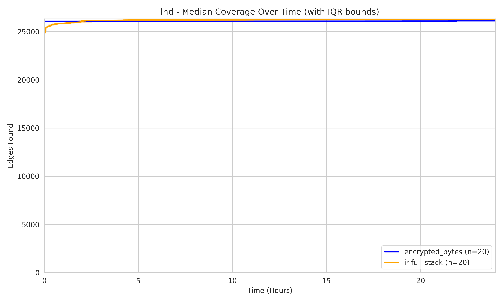

#### Distribution Comparisons

| Final Edge Coverage | Area Under Curve (Speed) |
|:---:|:---:|
| 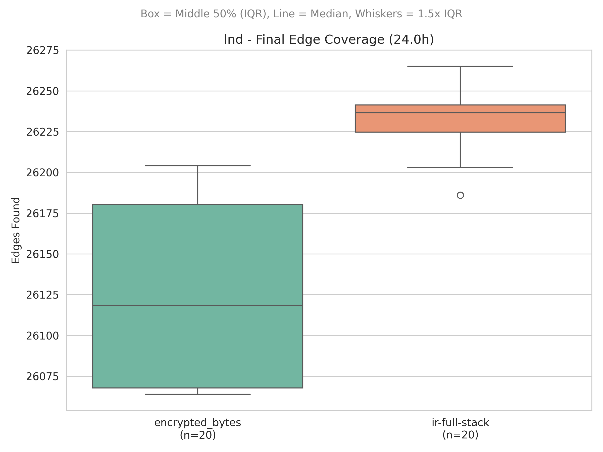 | 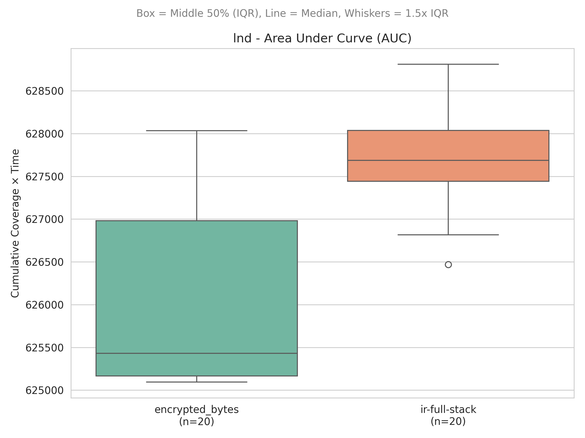 |

---

## 4. Mutator Ablation Study — Summary Statistics

Each table compares the full IR mutator stack (`ir-full-stack`) against that mutator ablated (`ir-<mutator>`), per target.

### Delete

| Target   |   Duration (h) |   n (Full) |   n (Ablated) |   Median Cov. (Full) |   Median Cov. (Ablated) |   Adj. p-value (Cov.) |   Â12 (Cov.) |   Median AUC (Full) |   Median AUC (Ablated) |   Adj. p-value (AUC) |   Â12 (AUC) |   Union Cov. (Full) |   Union Cov. (Ablated) |   Execs/s (Full) |   Execs/s (Ablated) |
|:---------|---------------:|-----------:|--------------:|---------------------:|------------------------:|----------------------:|-------------:|--------------------:|-----------------------:|---------------------:|------------:|--------------------:|-----------------------:|-----------------:|--------------------:|
| cln      |        23.9836 |         20 |            20 |               8367   |                  8561.5 |             0.0347508 |      0.26    |              196120 |                 202278 |           0.16955    |      0.3225 |               15841 |                  15060 |            6.035 |               5.815 |
| eclair   |        23.9833 |         20 |            20 |              11342.5 |                 11286.5 |             0.0347508 |      0.74375 |              269235 |                 266336 |           0.00274729 |      0.815  |               11856 |                  11766 |            3.805 |               3.5   |
| ldk      |        23.9833 |         20 |            20 |              15690   |                 15624.5 |             0.489446  |      0.60875 |              370165 |                 369070 |           0.239324   |      0.61   |               16460 |                  16085 |            9.28  |               9.185 |
| lnd      |        23.9833 |         20 |            20 |              26236.5 |                 26234   |             0.606999  |      0.54875 |              627688 |                 627357 |           0.215023   |      0.65   |               26399 |                  26391 |           11.025 |              10.595 |

### Gen-Insert

| Target   |   Duration (h) |   n (Full) |   n (Ablated) |   Median Cov. (Full) |   Median Cov. (Ablated) |   Adj. p-value (Cov.) |   Â12 (Cov.) |   Median AUC (Full) |   Median AUC (Ablated) |   Adj. p-value (AUC) |   Â12 (AUC) |   Union Cov. (Full) |   Union Cov. (Ablated) |   Execs/s (Full) |   Execs/s (Ablated) |
|:---------|---------------:|-----------:|--------------:|---------------------:|------------------------:|----------------------:|-------------:|--------------------:|-----------------------:|---------------------:|------------:|--------------------:|-----------------------:|-----------------:|--------------------:|
| cln      |        23.9833 |         20 |            20 |               8367   |                    8391 |            0.646918   |      0.55375 |              196118 |                 189354 |          0.228651    |      0.6125 |               15841 |                  15013 |            6.035 |               6.29  |
| eclair   |        23.9833 |         20 |            20 |              11342.5 |                   11305 |            0.646918   |      0.5925  |              269235 |                 267541 |          0.0287277   |      0.7275 |               11856 |                  12015 |            3.805 |               3.545 |
| ldk      |        23.9833 |         20 |            20 |              15690   |                   15578 |            0.101128   |      0.6975  |              370165 |                 355073 |          2.92439e-05 |      0.91   |               16460 |                  19002 |            9.28  |               8.625 |
| lnd      |        23.9833 |         20 |            20 |              26236.5 |                   26203 |            0.00590565 |      0.795   |              627688 |                 625450 |          5.72341e-07 |      0.9875 |               26399 |                  26372 |           11.025 |               8.165 |

### Reorder

| Target   |   Duration (h) |   n (Full) |   n (Ablated) |   Median Cov. (Full) |   Median Cov. (Ablated) |   Adj. p-value (Cov.) |   Â12 (Cov.) |   Median AUC (Full) |   Median AUC (Ablated) |   Adj. p-value (AUC) |   Â12 (AUC) |   Union Cov. (Full) |   Union Cov. (Ablated) |   Execs/s (Full) |   Execs/s (Ablated) |
|:---------|---------------:|-----------:|--------------:|---------------------:|------------------------:|----------------------:|-------------:|--------------------:|-----------------------:|---------------------:|------------:|--------------------:|-----------------------:|-----------------:|--------------------:|
| cln      |        23.9833 |         20 |            20 |               8367   |                  8595.5 |              0.203527 |      0.33    |              196118 |                 203173 |             0.311062 |      0.3675 |               15841 |                  14788 |            6.035 |                6.44 |
| eclair   |        23.9833 |         20 |            20 |              11342.5 |                 11317.5 |              0.37922  |      0.5825  |              269235 |                 268547 |             0.311062 |      0.6    |               11856 |                  12041 |            3.805 |                3.73 |
| ldk      |        23.9833 |         20 |            20 |              15690   |                 15617.5 |              0.187084 |      0.685   |              370165 |                 365989 |             0.015865 |      0.7675 |               16460 |                  16099 |            9.28  |                9.88 |
| lnd      |        23.9836 |         20 |            20 |              26236.5 |                 26224.5 |              0.203527 |      0.65375 |              627695 |                 627297 |             0.149591 |      0.6825 |               26399 |                  26350 |           11.025 |                9.99 |

### Splice

| Target   |   Duration (h) |   n (Full) |   n (Ablated) |   Median Cov. (Full) |   Median Cov. (Ablated) |   Adj. p-value (Cov.) |   Â12 (Cov.) |   Median AUC (Full) |   Median AUC (Ablated) |   Adj. p-value (AUC) |   Â12 (AUC) |   Union Cov. (Full) |   Union Cov. (Ablated) |   Execs/s (Full) |   Execs/s (Ablated) |
|:---------|---------------:|-----------:|--------------:|---------------------:|------------------------:|----------------------:|-------------:|--------------------:|-----------------------:|---------------------:|------------:|--------------------:|-----------------------:|-----------------:|--------------------:|
| cln      |        23.9833 |         20 |            20 |               8367   |                  8351   |             1         |      0.48125 |              196118 |                 195957 |           1          |      0.5125 |               15841 |                  15127 |            6.035 |              10.22  |
| eclair   |        23.9833 |         20 |            20 |              11342.5 |                 11286.5 |             1         |      0.555   |              269235 |                 267677 |           1          |      0.565  |               11856 |                  12473 |            3.805 |               5.075 |
| ldk      |        23.9833 |         20 |            20 |              15690   |                 27021.5 |             0.0361686 |      0.2575  |              370165 |                 411831 |           0.00936509 |      0.2175 |               16460 |                  35767 |            9.28  |              26.64  |
| lnd      |        23.9833 |         20 |            20 |              26236.5 |                 26216   |             0.135616  |      0.68625 |              627688 |                 627805 |           1          |      0.445  |               26399 |                  26719 |           11.025 |              27.72  |

