# Time-To-Exposure (TTE) Survival Analysis Report

**Baseline:** `encrypted_bytes`
**Experimental:** `ir`

**Tested bugs (>=1 discovery event in either arm):** 11  
**Excluded bugs (0 events in both arms, log-rank undefined):** 6

## 1. Summary Statistics

| Target   | BUG                 |   Baseline Finds |   Exp. Finds | Baseline Med. (s)   | Exp. Med. (s)   | Baseline IQR   | Exp. IQR    |   Adj. p-value (global) | Significant (global)   |   Adj. p-value (per-target) | Significant (per-target)   |
|:---------|:--------------------|-----------------:|-------------:|:--------------------|:----------------|:---------------|:------------|------------------------:|:-----------------------|----------------------------:|:---------------------------|
| cln      | dns_overflow        |               20 |           20 | 201                 | 6887            | 104-355        | 3001-22451  |             9.88429e-11 | True                   |                 3.59429e-11 | True                       |
| cln      | malformed_cannounce |               20 |           20 | 107                 | 3               | 10-211         | 2-3         |             9.88429e-11 | True                   |                 3.59429e-11 | True                       |
| cln      | openchannel_assert  |                0 |           20 | Not Reached         | 15061           | Not Reached    | 9300-19898  |             9.88429e-11 | True                   |                 3.59429e-11 | True                       |
| cln      | send_tlvs           |                0 |           20 | Not Reached         | 314             | Not Reached    | 146-373     |             9.88429e-11 | True                   |                 3.59429e-11 | True                       |
| eclair   | decode_drop         |               20 |           20 | 3                   | 1               | 2-3            | 1-3         |             0.187019    | False                  |                 0.187019    | False                      |
| eclair   | pubkey_exception    |               20 |            0 | 81                  | Not Reached     | 23-143         | Not Reached |             9.88429e-11 | True                   |                 2.69572e-11 | True                       |
| eclair   | unknown_message     |               20 |           20 | 86                  | 2               | 76-109         | 1-3         |             9.88429e-11 | True                   |                 2.69572e-11 | True                       |
| ldk      | reachable_unwrap    |                0 |           20 | Not Reached         | 78              | Not Reached    | 36-97       |             9.88429e-11 | True                   |                 8.98572e-12 | True                       |
| lnd      | gossiper_deadlock   |               20 |           20 | 174                 | 5               | 90-603         | 1-8         |             9.88429e-11 | True                   |                 2.69572e-11 | True                       |
| lnd      | malformed_tlv       |               20 |            0 | 48                  | Not Reached     | 19-83          | Not Reached |             9.88429e-11 | True                   |                 2.69572e-11 | True                       |
| lnd      | zero_timestamp      |                0 |           20 | Not Reached         | 1805            | Not Reached    | 1034-2168   |             9.88429e-11 | True                   |                 2.69572e-11 | True                       |

*A comprehensive version of this table is available in `survival_primary_results.csv`.*

### Bugs Not Exposed By Either Configuration

The following bugs were not triggered by any trial in either configuration within the 86400.0s timeout. Every trial is right-censored, so there are no observed event times for the log-rank statistic to compare and the test is undefined; these bugs are therefore excluded from the Holm-Bonferroni family above (`m` reflects only the tested bugs) rather than assigned a placeholder p-value.

| Target   | BUG                 |   Baseline Trials |   Exp. Trials |
|:---------|:--------------------|------------------:|--------------:|
| cln      | early_cupdate       |                20 |            20 |
| eclair   | htlc_propagation    |                20 |            20 |
| eclair   | shutdown_retransmit |                20 |            20 |
| ldk      | annsig_panic        |                20 |            20 |
| ldk      | channel_ready       |                20 |            20 |
| lnd      | cupdate_no_htlc     |                20 |            20 |

*Full detail is available in `survival_excluded_results.csv`.*

## 2. Interpretation Guide

Use the table above and the Kaplan-Meier plots below to evaluate the fuzzer's speed and reliability in triggering specific bugs.

### Key Metrics

- **`Finds`**: The number of trials (out of 20) that successfully triggered the bug within the 24-hour timeout. Trials that fail to find the bug are considered *censored*.
- **`Med. (s)`**: The median Time-To-Exposure. The exact wall-clock second at which 50% of the successful trials had found the bug. Lower is better. Reported as `Not Reached` when an arm had zero discovery events, since the KM curve never crosses 0.5 in that case.
- **`IQR`**: Interquartile Range (25th to 75th percentile). Represents the variance/consistency of the fuzzer's time-to-find. A narrow IQR indicates highly predictable performance.
- **`Adj. p-value (global)`**: Log-rank test p-value corrected for multiple comparisons via Holm-Bonferroni across all *tested* bugs (`m` = number of bugs with at least one discovery event in either arm). It tests the null hypothesis that there is no difference in the survival curves of the two configurations. `< 0.05` is statistically significant.
- **`Adj. p-value (per-target)`**: The same log-rank p-values, Holm-Bonferroni corrected within each target's sub-family instead of globally (addresses RQ4: is the effect consistent per target?). `m` for each target is the number of that target's tested bugs.

### Reading Kaplan-Meier Plots

Kaplan-Meier estimates the probability that a bug has **not yet been found** at a given time `t`. The curve starts at `1.0` (100% chance the bug is undiscovered) and steps downward each time a trial finds the bug.

- **Steeper drops** indicate faster discovery.
- **Shaded bands** represent the 95% Confidence Interval.
- If a curve **flatlines above 0**, it means some trials timed out (censored) before finding the bug.
- The experimental curve should ideally be **below and to the left** of the baseline curve.

## 3. Visualizations

### Tested Bugs

#### CLN - dns_overflow

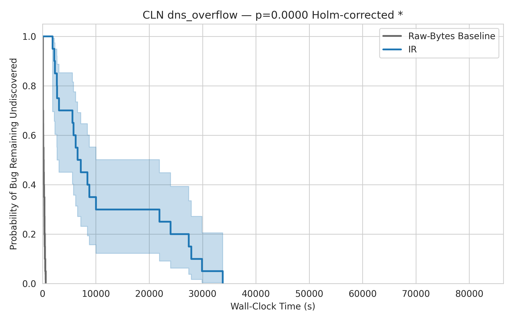

---

#### CLN - malformed_cannounce

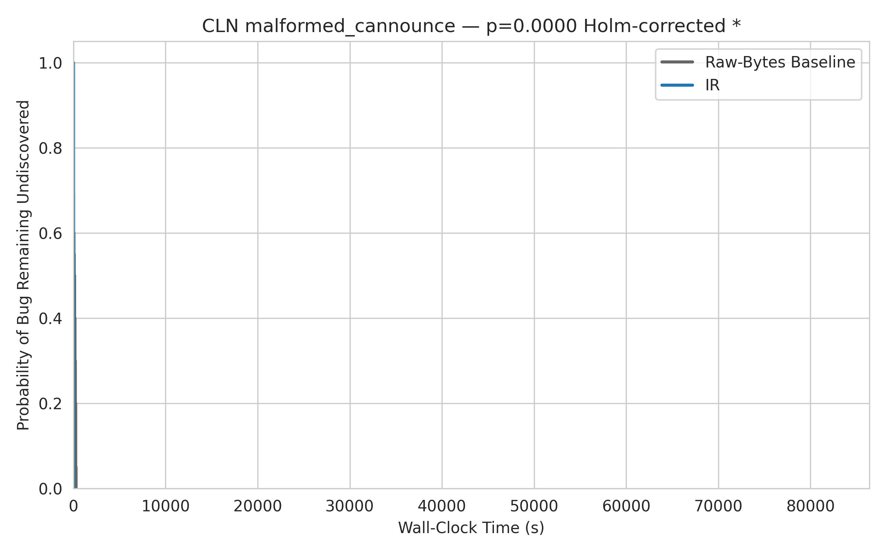

---

#### CLN - openchannel_assert

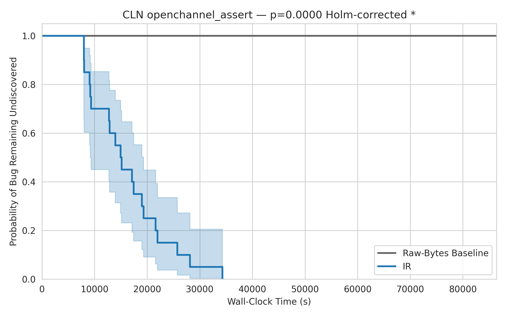

---

#### CLN - send_tlvs

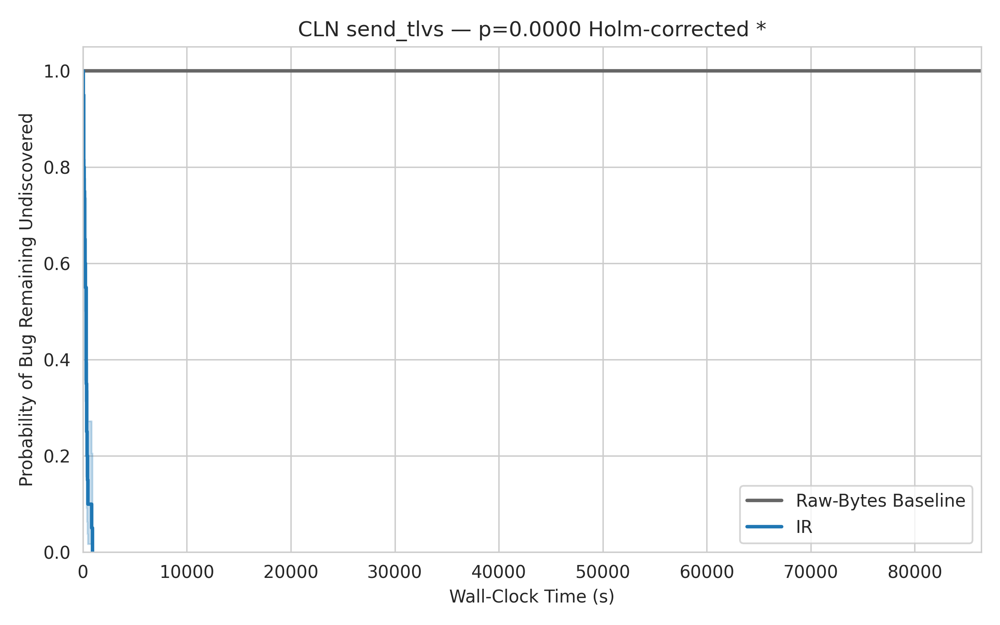

---

#### ECLAIR - decode_drop

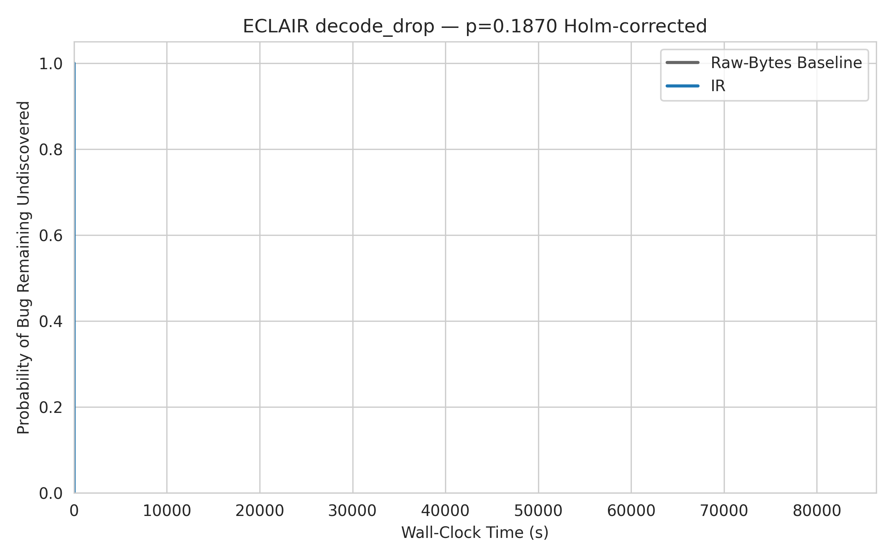

---

#### ECLAIR - pubkey_exception

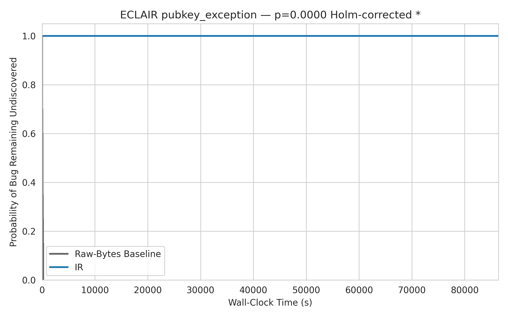

---

#### ECLAIR - unknown_message

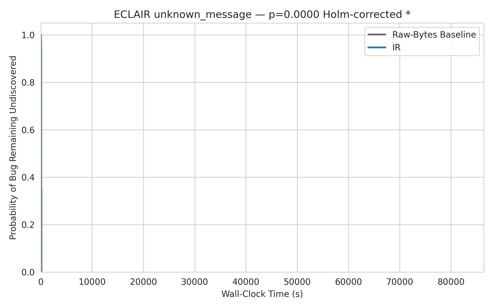

---

#### LDK - reachable_unwrap

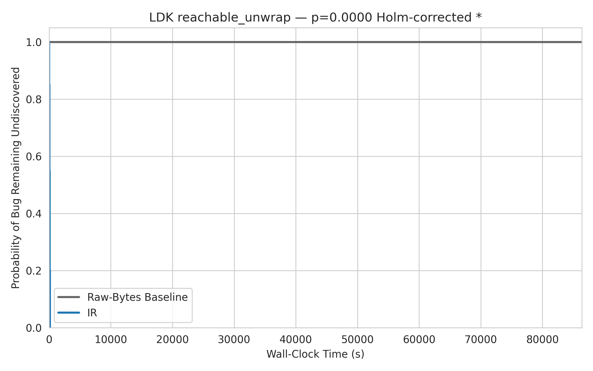

---

#### LND - gossiper_deadlock

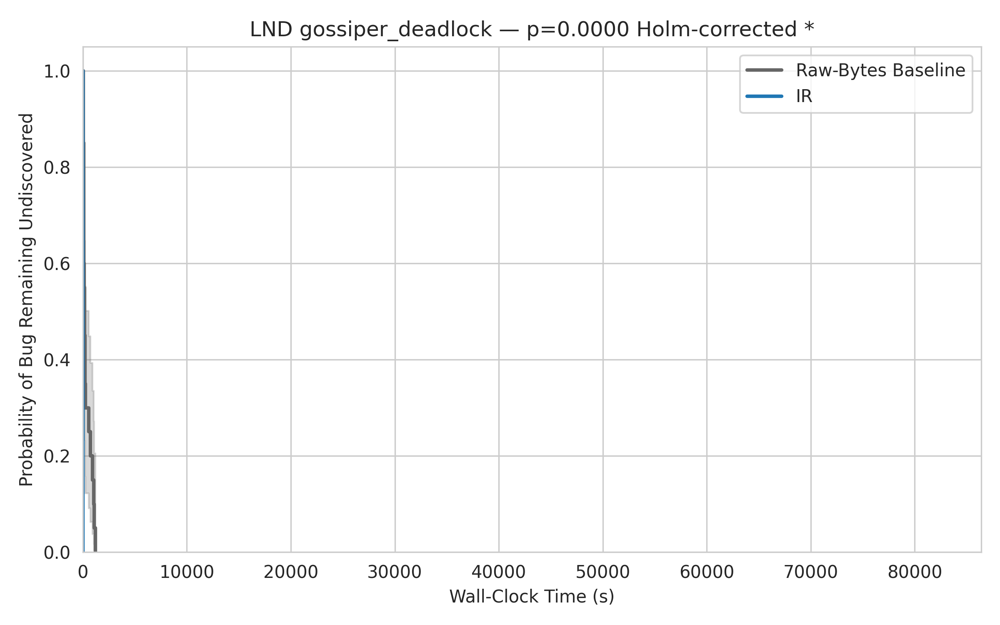

---

#### LND - malformed_tlv

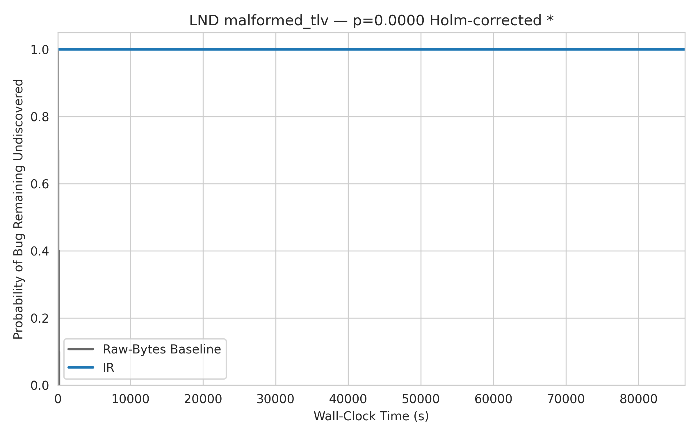

---

#### LND - zero_timestamp

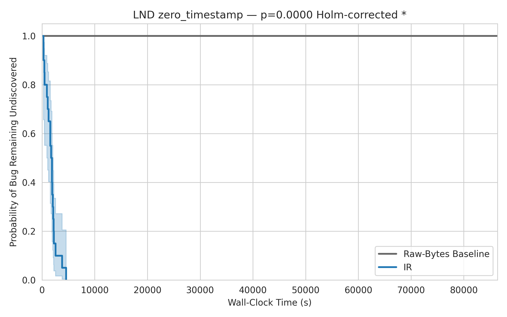

---

### Bugs Not Exposed By Either Configuration

#### CLN - early_cupdate

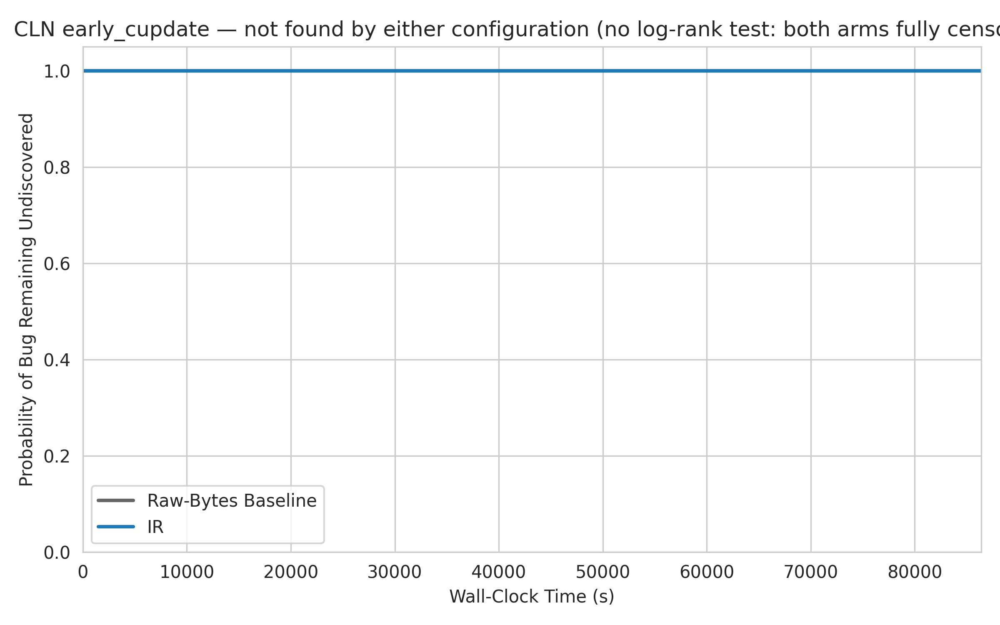

---

#### ECLAIR - htlc_propagation

---

#### ECLAIR - shutdown_retransmit

---

#### LDK - annsig_panic

---

#### LDK - channel_ready

---

#### LND - cupdate_no_htlc

---

